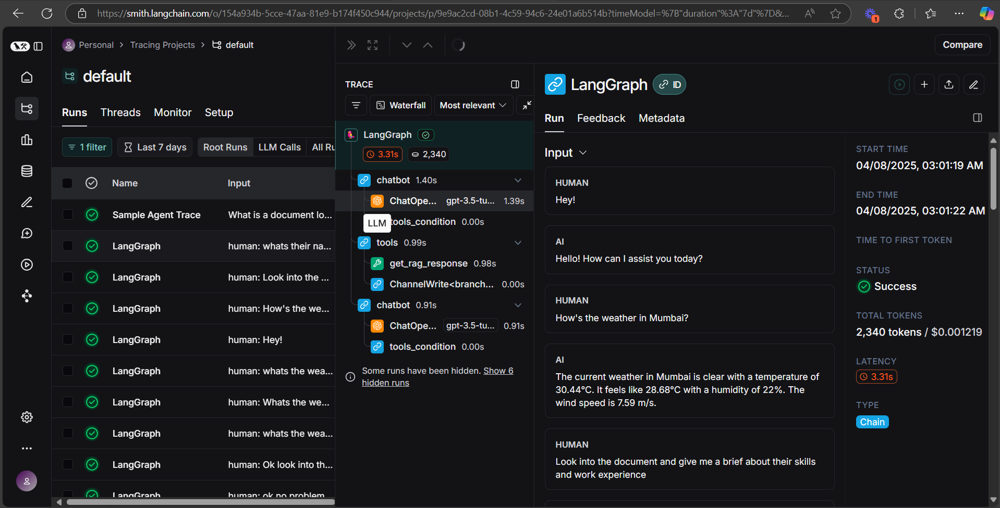

# How to run:
- Pull the qdrant image from docker: ```docker pull qdrant/qdrant```
- Run the qdrant docker container: ```docker run -p 6333:6333 -p 6334:6334  -v "$(pwd)/qdrant_storage:/qdrant/storage:z" qdrant/qdrant```
- Make sure you have all the environment variables set in the .env file.
- Install all required packages by running ```pip install -r requirements.txt```
- Run the streamlit server: ```streamlit run .\main.py```
- The Chat UI will be available on ```http://localhost:8501/```
- You can ask the bot about the weather in any cities, or ask it to fetch information from the documents that you upload.

# Demo:
- Loom Video: ```https://www.loom.com/share/fb48e149642541f59b1d02827d95eaa1```
- Langsmith Example: 